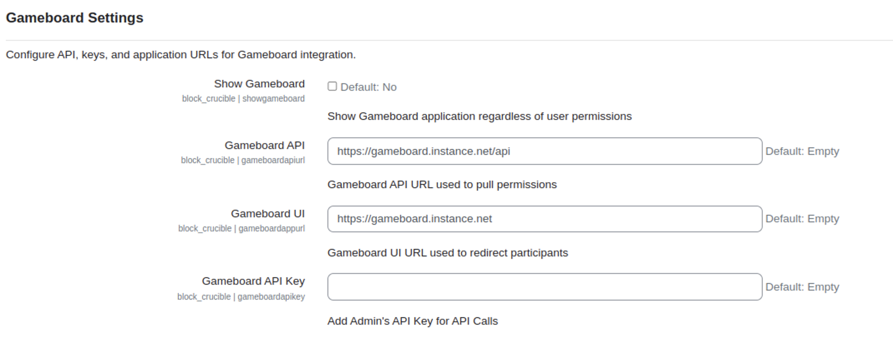
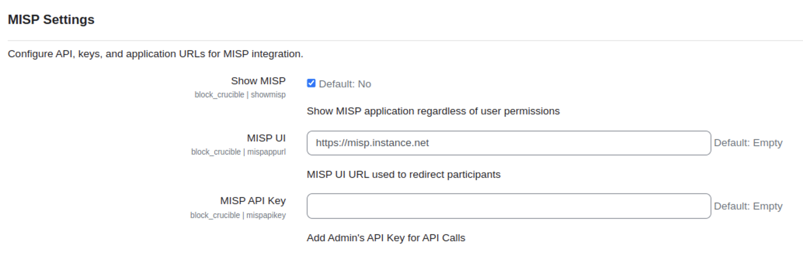
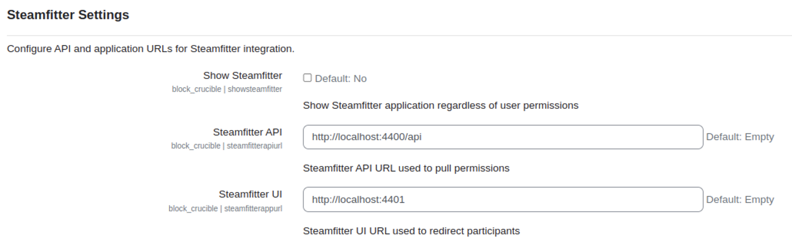

# Crucible Applications Landing Page Block for Moodle

## Table of Contents

1. [Description](#description)  
2. [License](#license)
3. [Installation](#1-installation)  
   - [Requirements](#11-requirements)  
   - [Configure the Oauth2 Issuer](#12-configure-the-oauth2-issuer)  
   - [Steps to Install](#13-steps-to-install)  
   - [Post-Installation Check](#14-post-installation-check)  
4. [Configuration](#2-configuration)  
   - [Global Settings](#21-global-settings)  
   - [Application Display Settings](#22-application-display-settings)  
5. [Usage Guide](#3-usage-guide)  
   - [How Users See the Landing Page](#31-how-users-see-the-landing-page)  
   - [Alternative Displays for Specific Scenarios](#32-alternative-displays-for-specific-scenarios)  
6. [Technical Details](#4-technical-details)  
   - [Code Structure and Files](#41-code-structure-and-files)  
   - [Key Functions and Logic](#42-key-functions-and-logic)  

## Description
The Crucible Applications Landing Page Block plugin for Moodle provides a streamlined "landing page" experience by displaying a list of integrated applications for users. Using a shared OAUTH account, the plugin identifies applications the user has permission to access, showing relevant icons and links. This block is intended for display on the user's dashboard, giving them quick, centralized access to all learning environment applications without needing to remember each URL.

> The following documentation is intended only for Moodle System Administrators.

## License
Crucible Applications Landing Page Block for Moodle

Copyright 2024 Carnegie Mellon University.

NO WARRANTY. THIS CARNEGIE MELLON UNIVERSITY AND SOFTWARE ENGINEERING INSTITUTE MATERIAL IS FURNISHED ON AN "AS-IS" BASIS.
CARNEGIE MELLON UNIVERSITY MAKES NO WARRANTIES OF ANY KIND, EITHER EXPRESSED OR IMPLIED, AS TO ANY MATTER INCLUDING, BUT NOT LIMITED TO,
WARRANTY OF FITNESS FOR PURPOSE OR MERCHANTABILITY, EXCLUSIVITY, OR RESULTS OBTAINED FROM USE OF THE MATERIAL.
CARNEGIE MELLON UNIVERSITY DOES NOT MAKE ANY WARRANTY OF ANY KIND WITH RESPECT TO FREEDOM FROM PATENT, TRADEMARK, OR COPYRIGHT INFRINGEMENT.
Licensed under a GNU GENERAL PUBLIC LICENSE - Version 3, 29 June 2007-style license, please see license.txt or contact permission@sei.cmu.edu for full terms.

[DISTRIBUTION STATEMENT A] This material has been approved for public release and unlimited distribution. Please see Copyright notice for non-US Government use and distribution.

This Software includes and/or makes use of Third-Party Software each subject to its own license.

DM24-1176

## 1. Installation
### 1.1 Requirements
**Moodle Version Compatibility**: This plugin is compatible with Moodle versions 3.x and above.
**OAuth2 Services Configuration:** The plugin relies on OAuth2 services, which need to be configured in Moodle with a service account logged in. Ensure that an OAuth issuer, such as Keycloak or another OAuth provider, is properly configured in Moodle for user authentication.
- **Service Account:** This service account must be authenticated and have necessary permissions to interact with applications integrated through the Crucible plugin.
- **OAuth2 Issuer:** Moodle must be configure with an Ouath2 issuer (e.g., Keycloak).

### 1.2 Configure the Oauth2 Issuer
Follow these steps to add Keycloak as an Oauth2 Identity Provider (IdP):

#### 1.2.1 Navigate to the Oauth2 Settings
1. Go to: `Site Administration > Server > Oauth 2 Services`
2. Click **Add** or **Edit** an existing issuer.

#### 1.2.2 Fill in Isssuer Settings
1. On the Oauth2 Settings page, fill the following fields accordingly:

| Field                                            | Value                                                           |
| ------------------------------------------------ | --------------------------------------------------------------- |
| **Name**                                         | `Keycloak`                                                  |
| **Client ID**                                    | `moodle-client`                                                 |
| **Client secret**                                | `<Your Keycloak client secret>`                                 |
| **Authenticate token requests via HTTP headers** | *(optional ✅ Check this box)*                                                |
| **Service base URL**                             | `https://keycloak.instance.com` *(correct the domain if needed)* |
| **Logo URL**                                     | `https://keycloak.instance.com/resources/16d5x/admin/keycloak.v2/favicon.svg` *(optional)*                     |
| **This service will be used**                    | `Login page and internal services`                              |
| **Name displayed on login page**                 | `Login`                                                         |
| **Scopes included in login request**             | `openid profile email alloy-api blueprint-api caster-api cite-api gallery-api gameboard-api player-api steamfitter-api topomojo-api vm-api`                                 |
| **Scopes included for offline access**           | `openid profile email offline_access alloy-api blueprint-api caster-api cite-api gallery-api gameboard-api player-api steamfitter-api topomojo-api vm-api`                           |
| **Login domains**                                | *(optional – restrict by domain if needed)*                     |
| **Require email verification**                   | *(optional – check based on security policy)*                   |

2. Click **Save changes** when done.

#### 1.2.3 Adding a User Field Mapping
Map the Keycloak **sub** field (a unique user ID) to Moodle's internal **idnumber** field to identify users consistently.

1. Navigate to `Site Administration > Server > Oauth2 Services`.
2. Locate the configured Oauth2 issuers (e.g., Keycloak).
3. Click on **Configure User Field Mappings** link for that issuer.
4. Click on **Create new user field mapping for issuer**.
5. In the form, fill the following fields:

| Field                   | Value      |
| ----------------------- | ---------- |
| **External field name** | `sub`      |
| **Internal field name** | `idnumber` |
6. Click the **Save Changes** button.

#### 1.2.4 Link Moodle Admin Account as System Account
1. Go to: `Site Administration > Server > Oauth2 Services`
2. Next to the Keycloak issuer you've just configure, click **Connect to a System Account** under the "System Account Connected" column.
3. You will be redirected to Keycloak to authenticate. Log in using the service/admin account you intend to use.
4. After successfully login, Moodle will link this Keycloak user as the **Oauth2 System Account**.

#### 1.2.5 Final Validation
1. Go back to **Oauth2 Services** and confirm that **Connected** appears next to the issuer under "System Account".

### 1.3 Steps to Install
1. **Download the Plugin:** Download the Crucible Applications Landing Page Block plugin as a zip file from the [CMU SEI Github Repository](https://github.com/cmu-sei/moodle-block_crucible/tree/main).
2. **Log In to Moodle as an Administrator**
3. **Upload the Plugin via the Moodle Plugin Installation Interface:**
- Go to `Site Administration > Plugins > Install Plugins`.
- Click `Choose a file` under `Install plugin from ZIP File` and select the downloaded plugin zip file.
- Click `Install plugin from the ZIP file` to proceed.
4. **Complete the Installation:**
- Moodle with automatically detect the new plugin and display an installation confirmation screen.
- Click **Continue** and follow the on-screen instructions to complete the installation.
5. **Finalize Settings:** Once installation is complete, Moodle may prompt you to configure initial settings for the plugin. You can choose to configure settings immediately or skip and configure later from `Site Administration > Plugins > Blocks > Applications`.

### 1.4 Post-Installation Check
After installation, confirm the plugin's presency by:
- Checking `Site Administration > Plugins > Blocks` to verify the plugin is listed.
- Navigating to a user's dashboard and confirming that the block appears as an option in the block selection menu.

## 2. Configuration
### 2.1 Global Settings
Access global settings by going to `Site Administration > Plugins > Blocks > Applications`. Here, you can configure general settings for the plugin, including the following options:
- **Enabled** Toggle the plugin's availability across Moodle by enabling or disabling this setting.
- **Issuer Id** Select the OAuth2 issuer (e.g., Keycloak) configured in Moodle for authentication with applications.
- **Show All Apps to Users:** Control whether all configured applications are shown by default.
- **Disable Block Title:** Optionally set a custom title for the block as it appears to users.
- **Enable Custom Welcome Message:** Option to enable a custom welcome message for users and enter a specific message to be displayed.

### 2.2 Application Display Settings
In this section, you can configure each application individually by setting URLs, API keys, and enabling/disabling each app.

#### Application Settings Overview
Each application has a dedicated settings section. Expand each section to get an overview of each configurable application and its specific settings:

<strong>Keycloak:</strong> Open Source Identity and Access Management

If enabled, the Keycloak block will be added to the Applications block. If the user has admin privileges or is part of a group that has admin privileges, the URL provided to the user will contain the `/admin/master/console` path. For regular users, the URL provided to the user will contain the `/realms/master/account` path.

- **Show Keycloak:** Show Keycloak application regardless of user permissions.
- **User Account Redirect:** When enabled, redirects all users to the same page used for user account management.
- **Keycloak User URL:** Specifies the Keycloak URL to which regular users are redirected. Ensure the URL includes the realm component without trailing /.
- **Keycloak Admin URL:** Specifies the Keycloak URL tto which admins are redirected. Ensure the URL includes the realm component without trailing /.
- **Admin Keycloak Groups:** Specify groups relevant to Keycloak for role-based permissions.

**Additional Configuration Requirements:**
- **Moodle Client Configuration in Keycloak:** The Keycloak integration will only function correctly if the Moodle client in Keycloak has the `Service Account` configuration enabled. This setup allows the Applications block to authenticate as a service account and access Keycloak's APIs for roles and groups.
- **View Roles in Keycloak:** To enable proper role-based permissions, the Keycloak client must also be configured to include `view roles` in the `Service Account Roles` section. This ensures that user roles are correctly fetched and applied for filtering and permissions management.

These configurations are essential to ensure seamless communication between Moodle and Keycloak for user authentication and role-based permissions.

<strong>Alloy: </strong>Conducting a Simulation

If the required URLs are added, the Alloy block will be added to the Applications block. However, this block will only show if the user has admin privileges in the Player application or if the user has any active views in the Player application. As a requirement, for this block to be enabled, the Player block should also be configured.

- **Show Alloy:** Show Alloy application regardless of user permissions.
- **Allow API:** Enter the API Endpoint URL for the Alloy application.
- **Alloy UI:** Enter the main URL for Alloy.

<strong>Blueprint: </strong>Building a MSEL

If the required URLs are added, the Blueprint block will be added to the Applications block. However, this block will only show if the user has admin privileges in the Blueprint application or if the user has any MSELs and the `Show All Applications` is checked.

- **Show Blueprint:** Show Blueprint application regardless of user permissions.
- **Blueprint API:** Enter the API Endpoint URL for the Blueprint application.
- **Blueprint UI:** Enter the main URL for Blueprint.

<strong>Caster: </strong>Coding a Topology

If the required URLs are added, the Caster block will be added to the Applications block. However, this block will only show if the user has admin privileges in the Caster application.

- **Show Caster:** Show Caster application regardless of user permissions.
- **Caster API:** Enter the API Endpoint URL for the Caster application.
- **Caster UI:** Enter the main URL for Caster.

<strong>CITE: </strong>Evaluating Threats

If the required URLs are added, the CITE block will be added to the Applications block. However, this block will only show if the user has admin privileges in the CITE application or if the user has an active evaluation and the `Show All Applications` is checked.

- **Show CITE:** Show CITE application regardless of user permissions.
- **CITE API:** Enter the API Endpoint URL for the CITE application.
- **CITE UI:** Enter the main URL for CITE.

<strong>Docs: </strong>Documentation

If the required URL is added, the Docs block will be added to the Applications block.

- **Docs UI:** Enter the main URL for Docs instance.

<strong>Gallery: </strong>Keeping You in the Know!

If the required URLs are added, the Gallery block will be added to the Applications block. However, this block will only show if the user has admin privileges in the Gallery application or if the user has an active exhibit and the `Show All Applications` is checked.

- **Show Gallery:** Show Gallery application regardless of user permissions.
- **Gallery API:** Enter the API Endpoint URL for the Gallery application.
- **Gallery UI:** Enter the main URL for Gallery.

<strong>Gameboard: </strong>Virtual Lab Training and Competition Platform

If the required URLs are added, the Gameboard block will be added to the Applications block. However, this block will only show if the user has admin privileges in the Gameboard application or if the user has an active gamespace and the `Show All Applications` is checked or the `Enable Gameboard` is checked.

- **Show Gameboard:** Show Gameboard application regardless of user permissions.
- **Gameboard API:** Enter the API Endpoint URL for the Gameboard application.
- **Gameboard UI:** Enter the main URL for Gameboard.
- **Gameboard API Key:** Provide the API key needed to connect with Gameboard.

<strong>MISP: </strong>Threat Intelligence and Sharing Platform

If the required URLs are added, the MISP block will be added to the Applications block. However, this block will only show if the user has admin privileges in the MISP application or if the user has an account and the `Show All Applications` is checked or the `Enable MISP` is checked.

- **Show MISP:** Show MISP application regardless of user permissions.
- **MISP UI** Enter the main URL for MISP.
- **MISP API Key:** Provide the API key needed to connect with MISP.

<strong>Player: </strong>Designing User Interfaces

If the required URLs are added, the Player block will be added to the Applications block. However, this block will only show if the user has admin privileges in the Player application or if the user has an active Player view.

- **Show Player:** Show Player application regardless of user permissions.
- **Player API:** Enter the API URL for Player.
- **Player UI:** Enter the main URL for Player.

<strong>Steamfitter: </strong>Crafting a Scenario

If the required URLs are added, the Steamfitter block will be added to the Applications block. However, this block will only show if the user has admin privileges in the Steamfitter application.

- **Show Steamfitter:** Show Steamfitter application regardless of user permissions.
- **Steamfitter API:** Enter the API URL for Steamfitter.
- **Steamfitter UI:** Enter the main URL for Steamfitter.

<strong>TopoMojo: </strong>Virtual Lab Builder

If the required URLs are added, the TopoMojo block will be added to the Applications block. However, this block will only show if the user has admin privileges in the Topomojo application or the `Enable TopoMojo` is checked.

- **Show TopoMojo:** Show TopoMojo application regardless of user permissions.
- **TopoMojo API:** Enter the API URL for Steamfitter.
- **TopoMojo UI:** Enter the main URL for Steamfitter.
- **TopoMojo API Key:** Enter the API key required for integration.

<strong>Communication Apps</strong>

- **Enable Communication Apps:** Toggle visibility of all communication-related applications.

<strong>Rocket.Chat & Roundcube</strong>

If the required URLs are added and the `Enable Communication Apps` is checked, the Rocket.Chat block will be added to the Applications block. However, this block will only show if the user has admin privileges in the Rocket.Chat application or the user has an account.

- **Rocket.Chat API:** Enter the API URL for Rocket.chat.
- **Rocket.Chat UI:** Enter the main URL for Rocket.Chat.
- **Rocket.Chat Auth Token:** Enter the authentication token required for integration.
- **Rocket.Chat User ID:** Specify the user ID tied to the authentication token for Rocket.Chat.

For Roundcube, if the required URL is added and the `Enable Communications Apps` is checked, the Roundcube block will be added to the Applications block. However, the block will only show if the user has admin privileges in the Blueprint application.

- **Roundcube UI:** Enter the URL for the Roundcube application.

## 3. Usage Guide
### 3.1 How Users See the Landing Page
Once configured, users will see a landing page with icons and links to the applications they have permissions to access. Each application displays as a tile with:
- **Icon:** Custom icon for each application
- **Name:** Application name.
- **Description:** Brief description of the application.
- **Direct Link:** Clicking the tile directs the user to the application.

### 3.2 Alternative Displays for Specific Scenarios
In certain cases, the plugin may display alternative views for the user depending on the configuration state:

1. **OAuth Configuration or Authentication Not Enabled**
If OAuth is not properly configured, or the user is not authenticated through OAuth:
- The plugin will display a message informing the user that the application list cannot be loaded because OAuth integration is required.

2. **Plugin Not Enabled:**
If the plugin is disabled globally in the settings:
- The block will either not appear on the user's dashboard, or it will display a message informing the user that the plugin is not currently enabled.

## 4. Technical Details
### 4.1 Code Structure and Files
The Crucible Applications Landing Page Block plugin consists of several key files and a logical structure to manage the functionalities.

1. [block_crucible.php](https://github.com/cmu-sei/moodle-block_crucible/blob/main/block_crucible.php): Defines the block behavior and configuration.

    **Key Features:**
    - Implements the `block_base` class to initialize the block.
    - Defines settings as the block title, applicability to specific pages, and header visibility.
    - Manages the block content based on user permissions and OAuth setup.
    - Handles fallback views if the plugin is dabled or OAuth configuration is missing.

2. [settings.php](https://github.com/cmu-sei/moodle-block_crucible/blob/main/settings.php): Provides the admin interface for global plugin configuration.

    **Key Features:**
    - Allows administrators to enable/disable the plugin, configure OAuth issuers, and set application-specific URLs.
    - Supports toggling visibility of applications based on API configurations and user permissions.
    - Includes options for a custom welcome message, Keycloak, and other integrations.

3. [classes/crucible.php](https://github.com/cmu-sei/moodle-block_crucible/blob/main/classes/crucible.php): Contains the core logic for interacting with external APIs and retrieving user-specifc data.

    **Key Features:**
    - OAuth client setup and validation.
    - API integrations for exeternal services.
    - Methods for retrieving permissions, views, and active challenges from integrated applications.
    - Detailed debugging for API response errors and missing configurations.

4. **Templates:**
- [with_applications.mustache](https://github.com/cmu-sei/moodle-block_crucible/blob/main/templates/with_applications.mustache): Renders the main view when applications are available.
- [no_oauth.mustace](https://github.com/cmu-sei/moodle-block_crucible/blob/main/templates/no_oauth.mustache): Displays a fallback message when OAuth is not configured or authenticated.
- [not_enabled.mustache](https://github.com/cmu-sei/moodle-block_crucible/blob/main/templates/not_enabled.mustache): Displays a message whe nthe plugin is globally disabled.

### 4.2 Key Functions and Logic
1. **OAuth Authentication:**
- **Setup:** The `setup_system` method in `crucible.php` initializes the OAuth client and validates user credentials via the configured issuer.
- **Validation:** Checks for missing configurations, such as the issuer ID or client secrets, and validates API responses to ensure the user is authenticated.

2. **Application Display Logic:**
- Each integrated application has corresponding methods in `crucible.php` to fetch user-specific data:
    - **Permissions:** Determines whether the user has access to specific applications.
    - **User Specific Data:** Fetches user-specific data in each application.
- The `get_content` method in `block_crucible.php` processes the retrieved data and determines the block content dynamically.

3. **Fallback Displays:**
- **No OAuth Configuration:** Displays the `no_oauth.mustache` templated when OAuth is not configured or the user is not authenticated.
- **Plugin Disabled:** Displays the `not_enabled.mustache` template when the plugin is globally disabled in the settings.

4. **Role-Based Filtering:**
- Role and group-based filtering are handled via method like `get_keycloak_groups` and `get_keycloak_roles`. These methods interact with the Keycloak API to retrieve user roles and groups.
- Custom roles and permissions for other integrated applications are fetched using corresponding API endpoints.

5. **Debugging and Error Handling:**
- All methods include robust debugging messages using Moodle's `debugging` function to log issues such as missing configurations, API errors, or unexpected responses.
- HTTP status codes are checked and handled appropriately to provide meaningful feedback.

By combining these files and logic, the plugin offers a centralized dashboard to access various integrated applications seamlessly, with role-based filtering and robust debugging capabilities for administrators.